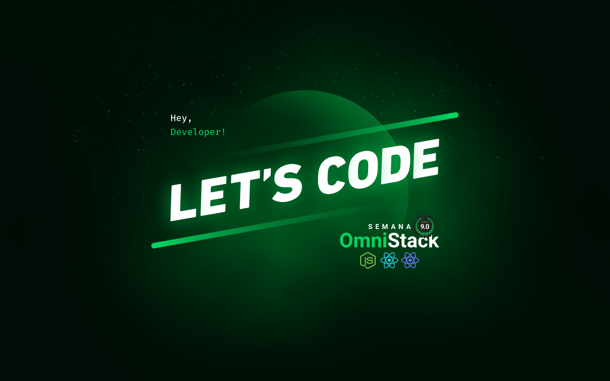

<p align="center">
  
  <br/>
</p>

<h3 align="center">
Spots a um clique de distância.
</h3>

<br><br>

<p align="center">
  
  
  
  
</p>
<br>

<p align="center">
  <a href="#sobre">Sobre</a> •
  <a href="#aircnc">Aircnc</a> •
  <a href="#instalação">Instalação</a> •
  <a href="#tecnologias">Tecnologias</a> •
  <a href="#autor">Autor</a>  
</p>

<br><br><br>

## Sobre

<p>
  Projeto desenvolvido durante a <strong>Semana OmniStack 9</strong>, evento criado pela <strong><a href="https://rocketseat.com.br/">Rocketseat</a></strong>.   
  Um evento 100% online e GRATUITO, com conteúdo exclusivo e INÉDITO.

Ocorreu do dia 30 de Setembro ao dia 06 de Outubro de 2019 e teve como intuito mostrar na prática o poder da stack
<strong><a href="https://nodejs.org/pt-br/">NodeJS</a></strong> +
<strong><a href="https://pt-br.reactjs.org/">ReactJS</a></strong> +
<strong><a href="https://reactnative.dev">React Native</a></strong> e como essas tecnologias podem te levar até os seus maiores objetivos como programador.

</p>

<br/><br/>



<br/><br/><br/>

## Aircnc

A aplicação AirCnC tem como objetivo servir de vitrine para empresas que querem disponibilizar spots para profissionais realizarem seus trabalhos no local. Sendo uma especie de co-working, o aplicativo possui dois modos de acesso: aplicação web e mobile, cada qual com sua responsabilidade e funcionalidades especificas as quais serão descritas abaixo:

### AirCnC - Aplicação web

A responsabilidade da aplicação web do AirCnC é o cadastro dos spots. É uma página web disponibilizada para que as empresas criem seu cadastro e realize o cadastro dos spots que desejam disponibilizar para seus futuros visitantes.

O fluxo é bem simples, primeiro o responsável pela empresa realiza o login na aplicação com seu email através da página abaixo:


Após o login o usuário é direcionado para a página dashboard que exibirá os spots já cadastrados e a opção de cadastro de novos spots, conforme tela abaixo:


Como vemos na tela acima, além dos spots já cadastrados, temos um botão para realizar novos cadastros. O cadastro de spot é bem simples e os únicos dados necessários são:

- Imagem do spot.
- Nome da empresa.
- Tecnologias utilizadas pela empresa.
- Valor da diária do spot.

Abaixo um exemplo de cadastro de um spot:


Com os spots disponibilizados para os demais usuários, basta aguardar que ocorra um agendamento e pronto, teremos a opção de aceitar ou rejeitar a solicitação de reserva que ocorre em tempo real com a comunicação entre mobile e web realizada através de websocket.

Abaixo um exemplo de alerta de solicitação de reserva na tela de dashboard. Pelo mobile, quando há a solicitação de reserva, o dono do spot é comunicado em tempo real (caso esteja com sessão ativa) sobre quem, quando e qual spot está sendo requisitado, conforme imagem abaixo:


### AirCnC - Aplicação mobile

A aplicação móvel tem como finalidade servir de ponte entre os spots disponíveis e os usuários que buscam spots para diárias. Ao se cadastrar na aplicação, o usuário informa seu email como forma de identificação e as tecnologias com que trabalha, dando a possibilidade para ele alocar um spot em uma empresa que utiliza a mesma stack dele para fortalecer o networking e a troca de conhecimento.


Após o cadastro, o usuário irá para a tela de dashboard onde os spots serão exibidos separados por tecnologia, conforme imagem abaixo:


Com o spot escolhido, basta o usuário clicar no botão de reserva e escolher a data que deseja visita-lo. Ao concluir o agendamento o dono do spot será alertado em tempo real que determinado usuário deseja alugar o spot na data preenchida pelo usuário. Seguem as telas desse fluxo:

|                    Formulário de agendamento                    |                  Confirmação de agendamento                   |
| :-------------------------------------------------------------: | :-----------------------------------------------------------: |
|  |  |

Após a solicitação ser enviada, ficará pendente a resposta do dono do spot. Quando a reserva for aceita ou rejeitada, o usuário que a solicitou será notificado com as informações da reserva e seu status, vide imagens a seguir:

|                         Reserva aceita                          |                        Reserva rejeitada                        |
| :-------------------------------------------------------------: | :-------------------------------------------------------------: |
|  |  |

<br/><br/>

## Instalação

Antes de começar, você vai precisar ter instalado em sua máquina as seguintes ferramentas:
[Git](https://git-scm.com), [Node.js](https://nodejs.org/en/) e [Docker](https://www.docker.com/).
Além disto é bom ter um editor para trabalhar com o código como [VSCode](https://code.visualstudio.com/).

### Criando container do mongoDB localmente

O comando abaixo irá baixar a imagem docker do mongo e criar um container com as configurações e senhas abaixo. Caso queira executar o mongo de outra maneira basta alterar a string de conexão presente no arquivo [server](./backend/src/server.js).

```bash
docker container run --name omnistack9 -e MONGO_INITDB_ROOT_USERNAME=omnistack9 -e MONGO_INITDB_ROOT_PASSWORD=admin -p 27017:27017 -d -v "mongoVolume:/data/db" mongo
```

### 🎲 Rodando o Back End (servidor)

```bash
# Clone este repositório
$ git clone git@github.com:MrRioja/OmniStack-9.git

# Acesse a pasta do projeto no terminal/cmd
$ cd OmniStack-9

# Vá para a pasta server
$ cd backend

# Instale as dependências
$ npm install
# Caso prefira usar o Yarn execute o comando abaixo
$ yarn

# Execute a aplicação em modo de desenvolvimento
$ npm run dev
# Caso prefira usar o Yarn execute o comando abaixo
$ yarn dev

# O servidor inciará na porta 3333 ou na porta definida no arquivo .env na variável APP_PORT - acesse <http://localhost:3333>
```

### 🖥️ Rodando o Front End (Web)

```bash
# Clone este repositório
$ git clone git@github.com:MrRioja/OmniStack-9.git

# Acesse a pasta do projeto no terminal/cmd
$ cd OmniStack-9

# Vá para a pasta server
$ cd frontend

# Instale as dependências
$ npm install
# Caso prefira usar o Yarn execute o comando abaixo
$ yarn

# Execute a aplicação em modo de desenvolvimento
$ npm run start
# Caso prefira usar o Yarn execute o comando abaixo
$ yarn start

# O servidor inciará na porta 3000 - acesse <http://localhost:3000>
```

### 📱 Rodando o App (Mobile)

```bash
# Clone este repositório
$ git clone git@github.com:MrRioja/OmniStack-9.git

# Acesse a pasta do projeto no terminal/cmd
$ cd OmniStack-9

# Vá para a pasta server
$ cd mobile

# Instale as dependências
$ npm install
# Caso prefira usar o Yarn execute o comando abaixo
$ yarn

# Execute a aplicação
$ expo start

# Será aberto no terminal o menu do Expo onde poderá scanear o QR Code para executar o app diretamente no seu celular ou as opções de executar no emulador android ou iOS
```

## Tecnologias


<br><br><br><br><br><br>

## Autor

<div align="center">

<h1>Luiz Rioja</h1>
<strong>Backend Developer</strong>
<br/>
<br/>

<a href="https://linkedin.com/in/luizrioja" target="_blank">

</a>

<a href="https://github.com/mrrioja" target="_blank">

</a>

<a href="mailto:lulyrioja@gmail.com?subject=Fala%20Dev" target="_blank">

</a>

<a href="https://api.whatsapp.com/send?phone=5511933572652" target="_blank">

</a>

<a href="https://join.skype.com/invite/tvBbOq03j5Uu" target="_blank">

</a>

<br/><br/>

</div>
